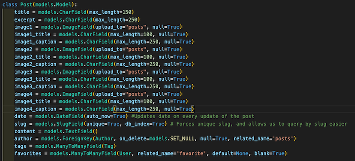
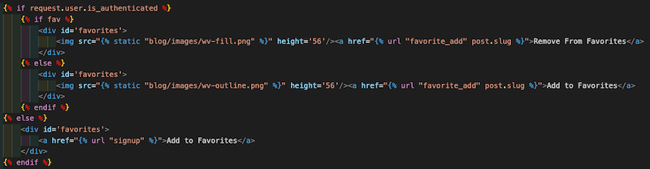

# Wandering West Virginia

<!--- These are examples. See https://shields.io for others or to customize this set of shields. You might want to include dependencies, project status and licence info here --->

Wandering WV is a full stack application that allows travelers to see places of interest within West Virginia. Places may hold historic, sightseeing, or intrinsic value. Each place is tagged with its county, and includes four photos with captions in a carousel.

## Notable Code

This is the code for my "post" model. It includes every image, title, and caption within one model. In retrospect, it may have been better practice to create a dedicated database for images, but this has proven quite useful all the same. 

This bit of code creates the "Add to Favorites" functionality on each article. It renders the outline of WV if the item is not in favorites, or a filled-in image of WV if the user has already added the post to favorites. Rather than use an .svg, I opted for two different .png images that will render based on a conditional statement. Additionally, if a user is not logged in, clicking "Add to Favorites" will send them to the signup page.

## Prerequisites

Before you begin, ensure you have met the following requirements:
<!--- These are just example requirements. Add, duplicate or remove as required --->
* You have installed the latest version of Python and Django.
* You are familiar with Bootstrap.

## Using Wandering WV

* Fork, clone, and open. 
* Use `python3 manage.py createsuperuser` and follow the prompts to create your admin user.
* Navigate to `http://localhost:8000/admin` to add or remove posts, comments, or users. 
* In the admin panel, click Posts, then the plus sign to add a new post. Make sure to include images, titles, and captions so the carousel will function properly.

## Contributing to Wandering WV
<!--- If your README is long or you have some specific process or steps you want contributors to follow, consider creating a separate CONTRIBUTING.md file--->
To contribute to Wandering, follow these steps:

1. Fork this repository.
2. Create a branch: `git checkout -b <branch_name>`.
3. Make your changes and commit them: `git commit -m '<commit_message>'`
4. Push to the original branch: `git push origin <project_name>/<location>`
5. Create the pull request.

Alternatively see the GitHub documentation on [creating a pull request](https://help.github.com/en/github/collaborating-with-issues-and-pull-requests/creating-a-pull-request).

## Contributors

So far it's just me, but I'd love to hear from you! If you have something to add, please follow the instructions for contributing to the project.

## Contact

If you want to contact me you can reach me on [LinkedIn](https://www.linkedin.com/in/amanda-posey-software-engineer/).

## License
<!--- If you're not sure which open license to use see https://choosealicense.com/--->

This project uses the following license: [CC BY-SA 4.0](https://creativecommons.org/licenses/by-sa/4.0/).